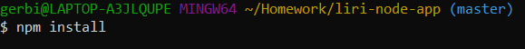
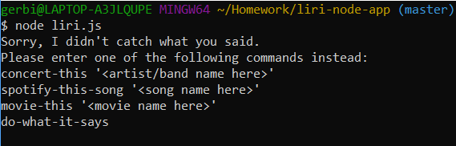
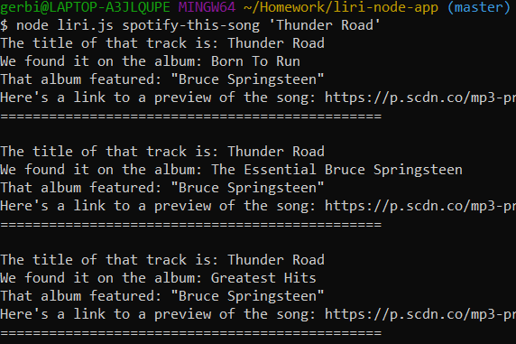
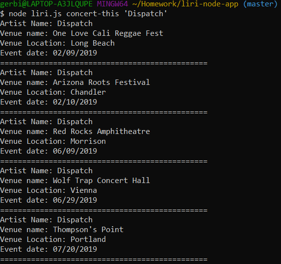
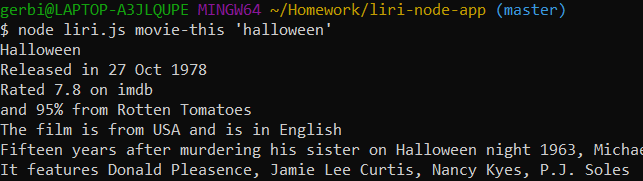
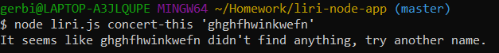
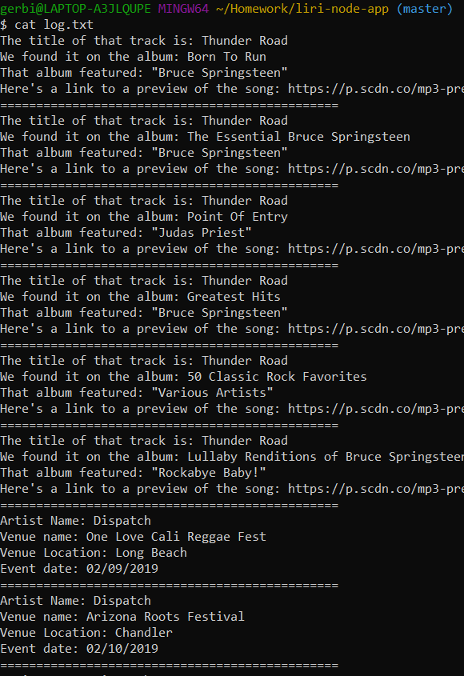

# liri-node-app
Liri is a command line node application.
It takes a set of commands and user input and returns data to the user.
The application queries APIs in order to gather the required data: bandsintown, spotify, and omdb
The data from each successful query is also logged into the log.txt file included with the application if the user wishes to reference it again.

# Getting Liri running

Liri requires node to function, if you have not installed node you can navigate to this site in order to download and install it:
    https://nodejs.org/en/

Once node is installed you must then install the required node modules.

You can do this by running 'npm install' on your command line in the same directory.

In the command line it will look like this:

That will install the modules and any dependencies from the package-lock.json file.

# Using Liri

Liri is run by entering a line of code into the command line.

What you enter will determine what function it performs.

If you simply use node to run liri without providing a function to perform it will respond with a list of the functions it can run.

Now that you see the different functions we can perform you can try out each of them:

    spotify-this-song will call to spotify and search for songs that match the string entered after the command.  Liri will then return any songs that have that string as their name.

    If you neglect to add a string after your command liri will automatically search for the song 'The Sign' by Ace of Base for you.

    Here we searched for 'Thunder Road' and got back several results.

    concert-this will call to bandsintown and search for any events featuring the band or artist entered after the command.  Liri then returns information about those concerts.

    If you neglect to add a band or artist after your command liri will remind you of the format for the concert-this command.

    Here we looked for the band 'Dispatch' and got their upcoming concerts.

    movie-this will call to omdb, the open movie database, and search for a movie based on the string you enter after the command.  Liri then returns details from the movie it finds.

    If you negelct to add a movie title after the command liri will search for the movie 'Mr.Nobody' for you.

    Here we looked for 'Halloween' and found the classic horro movie.

    The final command, do-what-it-says looks to a text document, random.txt.  Inside is a command and string that the liri will use when you enter this command.  You can change the command within to create a pre-determined search that will run with this final command.

    Try it and see what is inside.

# Handling errors and bad data

If liri runs into an error while making a call it will log the error to the command line.

If liri runs into bad data from the api or the search was not successful it will let you know it wasn't able to find anything for that search.

    Here we searched for a concert using a nonsense string 'ghghfhwinkwefn'

# Log.txt

After each succesful call you will see the text 'log.txt updated.'  This refers to the log.txt file included with the application.  

After each succesfull call liri prints the information for the user to read to the command line but it also saves that information to the log.txt file so the user may go back and refer to prior searches if they wish.

The user may simply open the file or they could read the file through the command line with the command 'cat log.txt'

This is some of the info saved to log.txt as we ran the tests to capture the images for this readMe